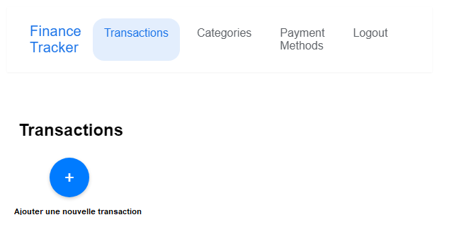

# Rapport d'UX

## Problèmes identifiés :

### Page login :

- **Contraste des couleurs insuffisant (bouton connexion) :**
  > Changement de la couleur du background du bouton afin que le contraste entre le texte et la couleur du bouton ait un contraste suffisant afin de respecter les règles d'accessibilité.
- **Pas de message d'erreur lorsque l'utilisateur n'arrive pas à se connecter :**
  > Modification du code dans Login.js afin de permettre à l'utilisateur de voir un message lui indiquant que la connexion a échouée.
- **Bouton login et register "fusionnés" :**
  > Changement CSS afin de rajouter une marge pour mieux visualiser la différence entre les boutons.

### Général :

- **Fonctionnalité de déconnexion non visible car "logout" ressemble à du simple texte**
  > Ajout du composant Link de React pour styliser "logout" afin que l'utilisateur puisse voir que c'est cliquable.
- **Le bouton + (permettant l'ajout d'une transaction, d'un moyen de paiement ou d'une catégorie) n'est pas visible et pas clair :**
  > Deplacer le bouton "+" à côté du titre de chaque page et ajouter un message informatif en dessous ou une tooltip afin d'expliciter à quoi sert ce bouton.
  > 
- **(Code pas bon non plus, aucune indication)**
  > Ajout d'un aria-label pour fournir une description du bouton dans le code HTML.
- **Problème de contraste sur la couleur de l'onglet sélectionné par rapport au bg de la page**
  > Modifications mineures du css à faire afin que les couleurs respectent les normes d'accessibilité
- **Navbar : Le contraste entre la couleur de la police et la couleur de l'onglet est trop faible**
  > Modifications mineures du css à faire afin que les couleurs respectent les normes d'accessibilité
- **Logout responsive : logout tronqué**
  > Modification du css afin que la Navbar s'affiche correctement sur tous les appareils et que les utilisateurs puissent accéder à toutes les fonctionnalités peu importe l'appareil utilisé
- **Clique n'importe où sur la page pour fermer les modales serait mieux qu'un clic sur la mini croix**
  > Ajout d'une fonctionnalité permettant de fermer une modale au clic n'importe où sur la page et ajouter une demande de confirmation de fermeture de la modale
- **L'utilisateur ne reste pas connecté lorsqu'il ferme le navigateur ou qu'il rafraichit la page**
  > Stockage du token dans le local storage du navigateur afin que l'utilisateur puisse rester connecté lorsqu'il quitte la page ou la rafraichit.
  <!-- Rajout case à cocher rester connecté -->

### Page transactions :

- **Si on ne pense pas à ajouter un moyen de paiement au préalable, on ne peut pas finaliser une transaction. Il faut alors sortir du formulaire de création d'une transaction puis aller dans "Payments methods" mais alors on perd les données du formulaire et on doit tout recommencer.**
  > Rajouter un texte explicatif ou avoir un message préventif nous indiquant qu'il faut ajouter un moyen de paiement avant de saisir une transaction
- **Les informations des transactions renseignées dans le form ne sont visibles nulle part.**
  > Rendre les transactions cliquables afin d'afficher les détails que l'on ne voit pas actuellement (catégorie, description)
- **Impossible de modifier ou supprimer une transaction enregistrée.**
  > Ajouter une fonctionnalité permettant de supprimer ou modifier les transactions déjà créées
- **Les transactions sont triées dans l'ordre où elles sont ajoutées au lieu d'être triées chronologiquement**
  > Modifier l'ordre d'affichage des transactions afin qu'elles s'affichent de manière chronologique par défaut.
- **Pas de filtre possible pour trier les transactions (+cher au moins cher, chronologique etc.)**
  > Ajouter une fonctionnalité permettant de trier les transactions par date / montant / type

### Page catégories :

- **Suppression d'une catégorie : Lorsque l'on supprime une catégorie, il faut changer d'onglet, sinon la suppression n'est pas visible. On peut cliquer en boucle pour supprimer en pensant que ça ne fonctionne pas. Aucune info**

  > Fix à faire afin que la suppression de la catégorie soit instantanée et/ou afficher un message confirmant la suppression

- **Quand on crée une nouvelle catégorie, l'icône pour choisir la couleur de celle-ci est incompréhensible.**
  > Icône pour choisir la couleur de la catégorie à modifier
- **La limite mensuelle du budget que l'on se fixe est affichée dans une couleur qui rend le texte illisible**
  > Ajouter un background afin de permettre d'avoir un texte toujours lisible ?,
- **La limite mensuelle peut être négative alors qu'elle ne devrait pas pouvoir l'être**
  > Empêcher que la limite mensuelle puisse être négative.
- **Aucune indication pour savoir où l'on en est dans notre budget (combien on a dépensé dans une catégorie ? La limite de budget est-elle atteinte ou dépassée ?) Est-ce qu'il y a eu des transactions ou non ? Ou sont les détails ?**
  > Ajout d'une fonctionnalité permettant d'avoir des indicateurs et des informations sur les dépenses effectuées jusqu'à maintenant (limites dépassées ? Somme totale dépensée par catégorie? etc.)

### Page Payment methods :

- Impossible de supprimer un moyen de paiement.
  > Fix du bug
